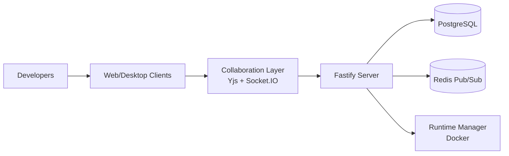

# Ghost Developer Studio

**Realtime collaborative developer operating system.**

> Multiple users. Same workspace. Same files. Live cursors. Live edits. Live presence.


Ghost Developer Studio is a real-time collaborative coding platform built for teams that want to design, code, review, and ship software together in a shared multiplayer environment. It is built as a multiplayer-first, event-driven developer platform monorepo.

---

## At a Glance

| 🧩 Component | ✨ What you get |
|---|---|
| Web Studio | Shared workspace UI with editor, chat, presence, and preview |
| Realtime Engine | Multi-user sync with Yjs + Socket.IO |
| Backend Services | Fastify APIs, auth, and collaboration handlers |
| Desktop App | Electron wrapper for local integrations |
| Shared Packages | Typed protocol, state stores, UI components, runtime + git modules |
| Multiplayer Terminals | Shared PTY sessions over Socket.IO (node-pty + xterm.js) |
| Collaborative Debugging | Shared breakpoints broadcast to all workspace members in real time |
| Branch Visualization | Real-time git graph with commit history and branch management |
| Session Replay | All events persisted; stream replay as NDJSON |
| AI Pair Programming | OpenAI-powered chat, completion, explanation, and code review |
| AI Task Orchestrator | Multi-step goal decomposition with step-by-step approval gates |
| Workspace Memory | Redis rolling window providing event context to every AI request |
| Observability | In-process Prometheus metrics, SLOs, enriched health endpoint |
| Audit Log | Full queryable event timeline per workspace with NDJSON export |
| RBAC | Role-based access control (owner/admin/editor/viewer) on all routes |
| Safe Edits | Proposed file changes with risk scoring and approval workflow |
| Plugin SDK | Typed extension API for commands, UI panels, events, and routes |
| Workspace Templates | Starter kits (Node API, Next.js, Python FastAPI) seeded on creation |
| Preview Environments | Ephemeral per-branch preview environments with auto-sleep |
| Onboarding Flow | Guided setup wizard for new workspace members |
| Reconnect Resilience | Exponential backoff reconnect with pending-op queue and status banner |
| Deployment Profiles | Docker Compose overlays for staging and production |



---

## Vision

Build a developer-first studio where distributed teams can:

- Write and review code together in real time
- Share infrastructure and environments safely
- Move from idea to deployment without leaving the platform
- Keep collaboration fast, transparent, and traceable

---

## Core Capabilities

- **Live collaborative editing** — multiple users edit the same file simultaneously with live cursors (Yjs + Monaco)
- **Workspace presence** — see who's online, what they're editing, and their cursor position
- **Workspace chat** — realtime messaging built into the dev environment
- **Live preview** — Docker-powered container builds with streaming logs and instant preview
- **Git integration** — clone, branch, commit, push via GitHub
- **Desktop app** — Electron wrapper with local filesystem and Docker access
- **Shared terminal access** for pair debugging, setup, and operational workflows
- **Notifications and activity tracking** for project awareness

---

## Architecture

```
ghost/
├── apps/
│   ├── web/          # Next.js React web app
│   ├── desktop/      # Electron desktop app
│   └── server/       # Fastify backend + Socket.IO
│
├── packages/
│   ├── protocol/      # Shared typed contracts (WS messages, interfaces)
│   ├── shared/        # Common utilities (generateId, colors, debounce)
│   ├── config/        # Environment validation (Zod schemas)
│   ├── events/        # Internal event bus (EventDispatcher)
│   ├── collaboration/ # Yjs engine + CollaborationClient (with reconnect + pending-op queue)
│   ├── observability/ # In-process metrics registry, SLOs, Prometheus exposition
│   ├── plugins/       # Plugin SDK: types, registry, built-in plugins
│   ├── editor/        # Monaco bindings + Ghost theme
│   ├── state/         # Zustand stores (workspace, editor, presence, chat, runtime)
│   ├── ui/            # Shared React components (Avatar, StatusBadge, Layout)
│   ├── database/      # Prisma schema + PostgreSQL client
│   ├── auth/          # JWT sign/verify utilities
│   ├── runtime/       # Docker orchestration (RuntimeManager)
│   └── git/           # Git integration (simple-git wrapper)
│
├── docker/           # Docker Compose + Dockerfiles
├── scripts/          # Dev setup scripts
└── .github/          # CI/CD workflows
```

### Realtime Collaboration Stack

```
Monaco Editor
  ↓ y-monaco binding
Yjs Document (Y.Text per file)
  ↓ CollaborationClient
Socket.IO (ws transport)
  ↓ Redis Adapter (pub/sub for horizontal scaling)
Server collaboration handler
  ↓ Prisma
PostgreSQL (binary Yjs state persisted per file)
```

### WebSocket Protocol

All messages use typed envelopes from `@ghost/protocol`:

```typescript
interface WsEnvelope {
  type: WsEventType    // e.g., 'document.update', 'presence.cursor'
  workspaceId: string
  actorId: string
  timestamp: string
  payload: object
}
```

---

## Tech Stack

| Layer         | Technology                              |
|---------------|-----------------------------------------|
| Frontend      | React, Next.js 15, TypeScript           |
| Styling       | TailwindCSS (Ghost dark theme)          |
| State         | Zustand                                 |
| Collaboration | Yjs, y-monaco, Socket.IO client         |
| Backend       | Fastify 5, Node.js 20, TypeScript       |
| Realtime      | Socket.IO 4, Redis pub/sub adapter      |
| Database      | PostgreSQL 16, Prisma ORM               |
| Desktop       | Electron 39                             |
| Runtime       | Docker (workspace preview containers)   |
| Monorepo      | TurboRepo, pnpm workspaces              |

---

## Quick Start

### Prerequisites

- Node.js 20+
- pnpm 9+
- Docker (for PostgreSQL, Redis, and workspace containers)

### Automated Setup

```bash
./scripts/dev-setup.sh
```

### Manual Setup

```bash
# Install dependencies
pnpm install

# Copy environment variables and edit them
cp .env.example .env

# Start infrastructure
docker compose -f docker/docker-compose.yml up -d postgres redis

# Run database migrations
pnpm --filter "@ghost/database" run db:migrate

# Build shared packages
pnpm run build --filter="./packages/*"

# Start all dev servers
pnpm run dev
```

### Access

| Service      | URL                                    |
|--------------|----------------------------------------|
| Web App      | http://localhost:3000                  |
| Server       | http://localhost:4000                  |
| Health       | http://localhost:4000/health           |
| Metrics      | http://localhost:4000/metrics          |

---

## API Reference (Key Endpoints)

| Method | Path | Description |
|--------|------|-------------|
| `POST` | `/auth/register` | Register a new user |
| `POST` | `/auth/login` | Log in, receive JWT |
| `GET` | `/api/workspaces` | List workspaces for the current user |
| `POST` | `/api/workspaces` | Create a workspace |
| `GET` | `/api/audit/:workspaceId` | Query workspace audit log |
| `GET` | `/api/audit/:workspaceId/export` | Export events as NDJSON (admin) |
| `POST` | `/api/ai/:workspaceId/complete` | AI code completion |
| `POST` | `/api/ai/:workspaceId/chat` | AI chat with workspace context |
| `POST` | `/api/tasks/:workspaceId/start` | Start an AI task orchestration |
| `POST` | `/api/tasks/:workspaceId/:id/approve` | Approve a pending task step |
| `POST` | `/api/safe-edits/:workspaceId` | Propose a safe file change |
| `POST` | `/api/safe-edits/:workspaceId/:id/approve` | Approve and apply a safe edit |
| `GET` | `/api/templates` | List workspace templates |
| `POST` | `/api/templates/:id/apply/:wsId` | Apply a template to a workspace |
| `POST` | `/api/previews/:workspaceId` | Create/wake a preview environment |
| `GET` | `/api/plugins` | List registered plugins |
| `GET` | `/metrics` | Prometheus metrics endpoint |
| `GET` | `/health` | Enriched health check with SLOs |

---

## Core Packages

### `@ghost/protocol`
Shared TypeScript interfaces and typed WebSocket contracts. Import here to get all shared types:
```typescript
import type { Workspace, WsMessage, PresenceState } from '@ghost/protocol'
```

### `@ghost/collaboration`
The realtime collaboration engine with reconnect resilience:
```typescript
const collab = new CollaborationClient({ userId, workspaceId, socket })
collab.joinWorkspace(displayName)
collab.openFile(fileId)
collab.on('connection:state', state => { /* 'connected' | 'reconnecting' | 'disconnected' */ })
collab.on('document:updated', fileId => { /* re-render */ })
```

### `@ghost/state`
Zustand stores for all UI state:
```typescript
const workspace = useWorkspaceStore(s => s.workspace)
const onlineUsers = usePresenceStore(s => s.onlineUsers)
const messages = useChatStore(s => s.messages)
const { status, previewUrl } = useRuntimeStore()
```

### `@ghost/events`
Internal event bus for server-side domain events:
```typescript
eventBus.on('file.updated', async event => {
  // trigger rebuild, broadcast, persist
})
await eventBus.dispatch('user.joined', workspaceId, { userId })
```

### `@ghost/observability`
Zero-dependency in-process metrics and SLOs:
```typescript
import { httpRequestsTotal, registry, evaluateSlos } from '@ghost/observability'
httpRequestsTotal.inc({ method: 'GET', route: '/api/workspaces', status_code: '200' })
console.log(registry.prometheusFormat()) // Prometheus text format
const slos = evaluateSlos()              // [{name, target, current, compliant}]
```

### `@ghost/plugins`
Plugin SDK for extending Ghost Developer Studio:
```typescript
import { pluginRegistry, type GhostPlugin } from '@ghost/plugins'

const myPlugin: GhostPlugin = {
  manifest: { id: 'my-plugin', name: 'My Plugin', version: '1.0.0', extensions: ['command'] },
  commands: [{ id: 'my-plugin.hello', label: 'Say Hello', handler: () => console.log('Hello!') }],
  events: [{ eventType: 'file.updated', handler: async (payload, ctx) => { /* react to changes */ } }],
}
await pluginRegistry.register(myPlugin, context)
```

---

## Development

```bash
pnpm run dev        # All apps in parallel
pnpm run build      # Production build
pnpm run typecheck  # TypeScript check
pnpm run lint       # ESLint
pnpm run test       # Tests
```

---

## Deployment

### Development
```bash
docker compose -f docker/docker-compose.yml up -d
```

### Staging
```bash
docker compose -f docker/docker-compose.yml -f docker/docker-compose.staging.yml up -d
```

### Production
```bash
docker compose -f docker/docker-compose.yml -f docker/docker-compose.prod.yml up -d
```

See `.env.example` for all required environment variables including `LOG_LEVEL`, `CORS_ORIGIN`, `SENTRY_DSN`, and `OIDC_*` for enterprise SSO.

---

## Design Principles

- **Collaborative by default:** core workflows support pair and team development out of the box
- **Context in one place:** code, runtime, review, and communication stay connected
- **Secure shared access:** collaboration preserves repository and environment safety boundaries
- **Incremental delivery:** capabilities introduced in stages with clear value at each step

---

## Product Goals

- **Speed:** reduce friction between coding, testing, and reviewing
- **Reliability:** maintain stable synchronized sessions for collaborators
- **Security:** support safe access to repositories and runtime environments
- **Scalability:** enable collaboration from small teams to larger organizations

---

## Contributing

Contributions are welcome as the project evolves. You can contribute by:

- Proposing features and use cases through issues
- Suggesting improvements to architecture and product documentation
- Submitting pull requests for implementation modules

---

## Future Roadmap

What's been implemented across all 5 milestones:

- ✅ **Milestone A — Stabilization** — Turbo fix, in-process observability + Prometheus metrics, SLOs, enriched health check, env hardening, staging/prod Docker overlays
- ✅ **Milestone B — Collaboration Maturity** — Exponential backoff reconnect, pending-op queue, connection state, `ReconnectBanner`, `ConflictResolutionModal`
- ✅ **Milestone C — Security & Governance** — RBAC middleware (owner/admin/editor/viewer), `/api/audit` with NDJSON export, `AuditPanel` UI, SSO/OIDC env foundation
- ✅ **Milestone D — AI Evolution** — Multi-step task orchestration with approval gates, safe-edit guardrails with risk scoring, `TaskOrchestratorPanel` UI
- ✅ **Milestone E — Extensibility** — Full Plugin SDK (`@ghost/plugins`), plugin registry, `/api/plugins` route, built-in Activity Feed plugin, plugin event bridge

Planned next milestones:

- **Milestone F — Desktop parity** — Feature parity between web and Electron, local filesystem mounts, offline mode
- **Milestone G — Enterprise scale** — Multi-tenant hardening, horizontal scaling benchmarks, disaster recovery playbooks
- **Milestone H — Product growth** — Usage analytics, community plugin marketplace, contributor program

---

## License

This project is released under the [MIT License](LICENSE).
